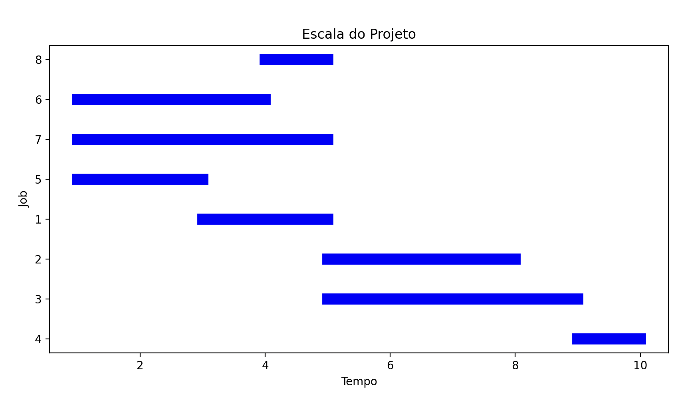

# CSP Solver
This is a simple CSP solver that uses backtracking to solve CSP problems. The solver is implemented in Python.
## Features
### Supported files
This is an example of a supported file. The file should contain the following sections:
```txt
************************************************************************
#General Information
************************************************************************
#Projects summary
pronr. 	#jobs 	rel.date 	duedate 	tardcost 	MPM-Time
 1      8      0         11        0         11
************************************************************************
#Precedence relations
#jobnr.    #modes  #successors   successors
   1        1          2           2   3
   2        1          1           4
   3        1          1           4
   4        1          0
   5        1          2          2   3
   6        1          1          4
   7        1          1          4
   8        1          0
************************************************************************
#Duration and resources
#jobnr. mode duration   R1   R2
  1      1     2       1    0
  2      1     3       0    1
  3      1     4       0    1
  4      1     1       0    1
  5      1     2       1    0
  6      1     3       0    1
  7      1     4       0    1
  8      1     1       0    1
************************************************************************
#Resource availability
#resource   qty
R1      1   
R2      2
************************************************************************
```
## How to replicate
### Install dependencies
```bash
pip3 install python-constraint pandas matplotlib
```
### Run the solver
```bash
python3 csp.py
```
## Output
### Example Output
#### Terminal Output
The output will be a list of jobs with their respective start and end times.
```txt
==================================================
SOLUTION FOUND!
==================================================

Total makespan: 20 time units

Detailed Schedule:
--------------------------------------------------
Job        Start      Duration   End       
--------------------------------------------------
5          11         2          13        
7          12         4          16        
6          12         3          15        
1          13         2          15        
3          15         4          19        
2          16         3          19        
4          19         1          20        
8          19         1          20        

Resource Utilization:
--------------------------------------------------
Maximum resource utilization:
R1: 1/1 units (max/capacity)
R2: 2/2 units (max/capacity)

==================================================
```
#### Job Schedule Graph
The program will also generate a Gantt chart showing the schedule of each job.

## How the Code Works
### Core Components
1. **File Parsing**
   - The program starts by parsing an input file containing project data
   - Input data includes project details, precedence relations, durations, and resource constraints
   - Data is parsed into structured dictionaries for easy processing

2. **Problem Setup**
   - Creates a CSP problem instance using the python-constraint library
   - Builds two main dictionaries:
     - `jobs`: Contains job information including successors, duration, and resource requirements
     - `resources`: Stores available quantities for each resource type

3. **Constraint Implementation**
   #### Precedence Constraints
   - Ensures jobs are scheduled in the correct order
   - Each job must complete before its successors can start
   - Implemented through the `check_precedence` function
   #### Resource Constraints
   - Prevents resource overallocation at any time
   - Tracks resource usage across the timeline
   - Implemented through the `check_resources` function
   #### Time Window Constraints
   - Calculates minimum start times based on precedence relations
   - Uses project due date as maximum timespan
   - Optimizes schedule to start as early as possible

4. **Solution Algorithm**
   The solver uses a two-phase approach:
   1. Initial solution finding using CSP backtracking
   2. Solution optimization using the `solve_asap` function to:
      - Find earliest possible start times
      - Maintain feasibility of all constraints
      - Minimize the overall makespan
### Output Details
The program provides comprehensive output including:
1. **Schedule Information**
   - Start time for each job
   - Duration of each job
   - End time for each job
   - Total makespan of the project

2. **Resource Analysis**
   - Maximum utilization for each resource type
   - Comparison against available capacity
   - Resource usage timeline
## Implementation Notes
### Key Functions
- `calculate_minimum_start_times()`: Computes earliest possible start times
- `check_precedence()`: Validates precedence relationships
- `check_resources()`: Ensures resource constraints are met
- `solve_asap()`: Optimizes the schedule for earliest possible starts
### Optimization Strategy
The solver implements a "as soon as possible" scheduling strategy by:
1. Finding a valid initial solution
2. Iteratively moving jobs earlier while maintaining feasibility
3. Considering both precedence and resource constraints during optimization
## Limitations
- The solver assumes single-mode activities
- All resources are renewable
- No preemption is allowed (jobs cannot be interrupted once started)
- Resource requirements are constant throughout job duration